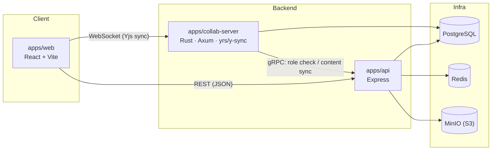

# infra-docs

> A real-time collaborative Wiki / document platform built on Yjs CRDT — a React + Express + Rust full-stack pnpm monorepo.

[](#license)
[](https://github.com/lhx-space/infra-docs)

**[English](./README.md) | [简体中文](./README.zh-CN.md)**

Multiple Teams, each owning multiple Wikis, each Wiki holding a tree of documents. Both document titles and body content support multi-user real-time collaborative editing (powered by [Yjs](https://github.com/yjs/yjs) CRDTs), alongside document version history, team invites & share links, a rich text editor (tables / code blocks / Mermaid diagrams / video embeds), full-text search, and frontend error monitoring.

## Features

- **Real-time collaborative editing** — both title and body live in a shared `Y.Doc`; concurrent edits merge automatically via CRDT. Online collaborator presence and cursors are rendered live, role checks happen at the connection level, and legacy documents are lazily migrated on first collaborative open.
- **Team / Wiki workspaces** — multiple Wikis per Team, a tree-structured document hierarchy per Wiki, role-based access control (`OWNER` / `EDITOR` / `VIEWER`, etc.), invite links and shareable links.
- **Rich text editor** (built on [Tiptap](https://tiptap.dev/)) — tables, task lists, syntax-highlighted code blocks, images, Mermaid diagrams, embedded video (with transcoding), a document outline, and a slash-command menu.
- **Document version history** — collaborative editing sessions are aggregated into version snapshots following configurable rules; historical contributors remain traceable.
- **Frontend error monitoring** — a unified error-reporting protocol covering render errors, runtime exceptions, unhandled promise rejections, resource load failures, network connection failures, and manual reports. See [`packages/error-monitor`](./packages/error-monitor).
- **Desktop client** — an Electron-based desktop shell ([`apps/desktop`](./apps/desktop)).

## Architecture



- `apps/web` talks to `apps/collab-server` directly over WebSocket (`y-websocket`) for real-time document sync, and to `apps/api` over REST for everything else.
- `apps/collab-server` (Rust) and `apps/api` (Node) communicate over **gRPC**: the connection is authorized against `apps/api` on connect, and the latest content is synced back to Postgres on a periodic schedule.
- `apps/api` also runs a separate `worker` process (BullMQ + Redis) for CPU-bound jobs such as video transcoding, kept out of the HTTP request path.

## Tech stack

| Module | Stack |
| --- | --- |
| [`apps/web`](./apps/web) | React 19 · Vite · Tailwind CSS · Zustand · React Router · Radix UI |
| [`apps/api`](./apps/api) | Express · Prisma (PostgreSQL) · BullMQ (Redis) · MinIO · gRPC · Pino |
| [`apps/collab-server`](./apps/collab-server) | Rust · Axum · [yrs](https://github.com/y-crdt/y-crdt) / y-sync · Tonic (gRPC) |
| [`apps/desktop`](./apps/desktop) | Electron · React |
| [`packages/tiptap-editor`](./packages/tiptap-editor) | [Tiptap](https://tiptap.dev/) 3 rich text editor wrapper (React), with collaboration, Mermaid, and video extensions |
| [`packages/error-monitor`](./packages/error-monitor) | Framework-agnostic frontend error-monitoring SDK (core + React/Vue subpaths) |

## Repository layout

```
.
├── apps/
│   ├── web/            — React + Vite frontend
│   ├── api/             — Express API service (plus its worker process)
│   ├── collab-server/   — Rust real-time collaboration service
│   └── desktop/         — Electron desktop client
├── packages/
│   ├── tiptap-editor/   — rich text editor wrapper
│   └── error-monitor/   — frontend error-monitoring SDK
├── protos/               — gRPC .proto contracts shared by apps/api ↔ apps/collab-server
├── openspec/             — spec-driven change management (proposal/design/spec/tasks, see below)
├── docker-compose.yml    — local infra + full-stack service orchestration
└── Makefile              — shortcuts for common commands
```

## Getting started

### Prerequisites

- [Node.js](https://nodejs.org/) ≥ 22 (pinned version in [`.nvmrc`](./.nvmrc))
- [pnpm](https://pnpm.io/) ≥ 9 (`packageManager` field pins 10.x)
- [Rust](https://www.rust-lang.org/) (version in [`rust-toolchain.toml`](./rust-toolchain.toml)), plus a system-level `protoc` (required to build `apps/collab-server`'s gRPC code)
- [Docker](https://www.docker.com/) / Docker Compose (for local PostgreSQL / Redis / MinIO)

### Install & bootstrap

```bash
git clone https://github.com/lhx-space/infra-docs.git
cd infra-docs

make setup          # install deps + generate each service's .env, equivalent to:
# = pnpm install
# = cp apps/api/.env.example apps/api/.env
# = cp apps/collab-server/.env.example apps/collab-server/.env

make up              # start local infra: postgres / redis / minio
pnpm --filter=@app/api run generate:prisma
pnpm --filter=@app/api run migrate:prisma
```

### Run in development

```bash
pnpm dev             # runs every app under apps/* in parallel (including api's worker subprocess)
make dev-collab      # in a separate terminal: cargo run for the Rust collaboration service
```

| URL | Service |
| --- | --- |
| http://localhost:5173 | `apps/web` (Vite dev server) |
| http://localhost:3000 | `apps/api` (REST) |
| ws://localhost:4000/ws | `apps/collab-server` (Yjs WebSocket) |
| http://localhost:9001 | MinIO console |

### Run the full stack with Docker

```bash
make up-full         # docker compose --profile full up -d --build
```

This additionally builds and starts `api` / `worker` / `collab-server` / `web` containers alongside the base infrastructure, giving you a fully working stack.

## Common commands

Run `make help` to see every available target; the underlying `pnpm` scripts also work directly:

```bash
pnpm build           # build every apps/* + packages/* (Node/frontend, excludes Rust)
pnpm dev             # parallel dev mode
pnpm typecheck       # TypeScript check across the whole workspace
pnpm lint            # biome + stylelint
pnpm lint:fix        # auto-fix lint issues
```

Rust side (`apps/collab-server`):

```bash
make check           # cargo check
make clippy          # cargo clippy -- -D warnings
make fmt              # cargo fmt
make test-rust        # cargo test
```

## Spec-driven change management (OpenSpec)

Feature work in this repository follows the [OpenSpec](https://github.com/Fission-AI/OpenSpec) workflow: every change produces `proposal.md` (why), `design.md` (how), `specs/**/spec.md` (capability spec deltas), and `tasks.md` (task checklist) under `openspec/changes/<change-name>/`. Once implemented, the change is archived to `openspec/changes/archive/`, and its spec deltas are merged into the main capability specs under `openspec/specs/`. To see the current, fully-merged behavior contract for any capability, read `openspec/specs/<capability>/spec.md` directly.

## Scaffolding

This monorepo was bootstrapped from [`lhx-cli`](https://juwenzhang.github.io/lhx-kit/), a custom monorepo scaffold used across the author's projects (`lhx-cli create --template=business-mono`, with `lhx-cli add package` for adding new workspace packages). The scaffold's own placeholder `homepage`/`repository`/`bugs` fields have since been corrected to point at this project's actual repository, <https://github.com/lhx-space/infra-docs>.

## License

MIT
