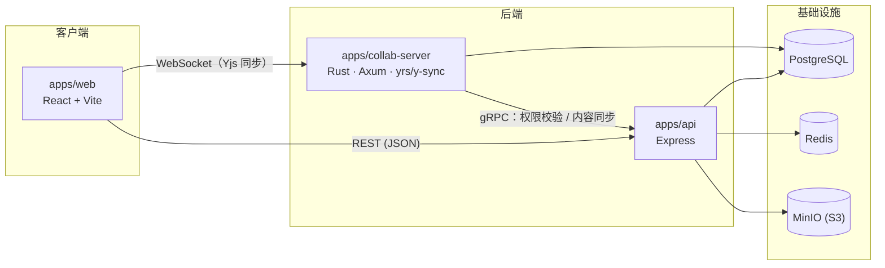

# infra-docs

> 一个基于 Yjs CRDT 的多人实时协同 Wiki / 文档平台 —— React + Express + Rust 全栈 pnpm monorepo。

[](#license)
[](https://github.com/lhx-space/infra-docs)

**[English](./README.md) | [简体中文](./README.zh-CN.md)**

多个 Team 下管理多个 Wiki，Wiki 下是树状结构的文档，文档标题与正文均支持多人实时协同编辑（基于 [Yjs](https://github.com/yjs/yjs) CRDT），并覆盖文档版本历史、团队邀请与分享链接、富文本编辑（表格/代码块/Mermaid/视频嵌入）、全文搜索、前端错误监控等能力。

## 特性

- **多人实时协同编辑**：文档标题 + 正文统一走 `Y.Doc` 共享状态，多端编辑自动 CRDT 合并，在线协作者 presence 与光标实时展示，连接级角色鉴权，存量文档惰性初始化。
- **Team / Wiki 工作区**：Team 下多个 Wiki，Wiki 下树状文档结构，基于角色的访问控制（`OWNER`/`EDITOR`/`VIEWER` 等），邀请链接与分享链接。
- **富文本编辑器**（[Tiptap](https://tiptap.dev/) 封装）：表格、任务列表、代码高亮、图片、Mermaid 图表、视频嵌入（含转码），支持文档大纲与拆分引导。
- **文档版本历史**：协同编辑会话按规则聚合成版本快照，历史编辑人可追溯。
- **前端错误监控**：统一的错误上报协议（渲染错误/运行时异常/未捕获 Promise/资源加载失败/网络连接失败/手动上报），见 [`packages/error-monitor`](./packages/error-monitor)。
- **桌面端**：基于 Electron 的桌面客户端（[`apps/desktop`](./apps/desktop)）。

## 架构总览



- `apps/web` 通过 `y-websocket` 直连 `apps/collab-server` 做实时协同同步，通过 REST 调 `apps/api` 做除协同内容外的一切业务操作。
- `apps/collab-server`（Rust）与 `apps/api`（Node）之间通过 **gRPC** 通信：连接建立时向 `apps/api` 校验角色权限，正文/标题变更按周期把最新内容同步落库。
- `apps/api` 额外拆出一个 `worker` 进程（BullMQ + Redis）跑视频转码等 CPU 密集任务，跟 HTTP 处理进程分离。

## 技术栈

| 模块 | 技术 |
| --- | --- |
| [`apps/web`](./apps/web) | React 19 · Vite · TailwindCSS · Zustand · React Router · Radix UI |
| [`apps/api`](./apps/api) | Express · Prisma (PostgreSQL) · BullMQ (Redis) · MinIO · gRPC · Pino |
| [`apps/collab-server`](./apps/collab-server) | Rust · Axum · [yrs](https://github.com/y-crdt/y-crdt) / y-sync · Tonic (gRPC) |
| [`apps/desktop`](./apps/desktop) | Electron · React |
| [`packages/tiptap-editor`](./packages/tiptap-editor) | [Tiptap](https://tiptap.dev/) 3 富文本编辑器封装（React），支持协同、Mermaid、视频等扩展 |
| [`packages/error-monitor`](./packages/error-monitor) | 框架无关的前端错误监控 SDK（核心 + React/Vue 子路径） |

## 目录结构

```
.
├── apps/
│   ├── web/            — React + Vite 前端
│   ├── api/             — Express API 服务（含 worker 进程）
│   ├── collab-server/   — Rust 实时协同服务
│   └── desktop/         — Electron 桌面客户端
├── packages/
│   ├── tiptap-editor/   — 富文本编辑器封装
│   └── error-monitor/   — 前端错误监控 SDK
├── protos/               — gRPC .proto 契约（apps/api ↔ apps/collab-server 共用）
├── openspec/             — 规格驱动的变更管理（proposal/design/spec/tasks，见下文）
├── docker-compose.yml    — 本地基础设施 + 全量服务的容器编排
└── Makefile              — 常用命令的快捷封装
```

## 快速开始

### 前置依赖

- [Node.js](https://nodejs.org/) ≥ 22（版本见 [`.nvmrc`](./.nvmrc)）
- [pnpm](https://pnpm.io/) ≥ 9（`packageManager` 字段锁定 10.x）
- [Rust](https://www.rust-lang.org/)（版本见 [`rust-toolchain.toml`](./rust-toolchain.toml)），以及系统级 `protoc`（编译 `apps/collab-server` 的 gRPC 代码需要）
- [Docker](https://www.docker.com/) / Docker Compose（跑本地 PostgreSQL / Redis / MinIO）

### 安装与初始化

```bash
git clone https://github.com/lhx-space/infra-docs.git
cd infra-docs

make setup          # 安装依赖 + 生成各服务 .env（等价于下面两步）
# = pnpm install
# = cp apps/api/.env.example apps/api/.env
# = cp apps/collab-server/.env.example apps/collab-server/.env

make up             # 启动本地基础设施：postgres / redis / minio
pnpm --filter=@app/api run generate:prisma
pnpm --filter=@app/api run migrate:prisma
```

### 启动开发环境

```bash
pnpm dev            # 并行启动 apps/* 下所有 Node/前端应用（含 api 的 worker 子进程）
make dev-collab     # 另开一个终端：cargo run 启动 Rust 协同服务
```

| URL | 服务 |
| --- | --- |
| http://localhost:5173 | `apps/web`（Vite dev server） |
| http://localhost:3000 | `apps/api`（REST） |
| ws://localhost:4000/ws | `apps/collab-server`（Yjs WebSocket） |
| http://localhost:9001 | MinIO 管理控制台 |

### 用 Docker 跑完整栈

```bash
make up-full        # docker compose --profile full up -d --build
```

会额外构建并启动 `api` / `worker` / `collab-server` / `web` 四个容器，跟基础设施一起组成完整可用的一套环境。

## 常用命令

优先用 `make help` 查看全部可用命令；也可以直接用 `pnpm`：

```bash
pnpm build          # 构建全部 apps/* + packages/*（Node/前端，不含 Rust）
pnpm dev             # 并行开发模式
pnpm typecheck       # TypeScript 全量类型检查
pnpm lint            # biome + stylelint 检查
pnpm lint:fix        # 自动修复
```

Rust 侧（`apps/collab-server`）：

```bash
make check           # cargo check
make clippy          # cargo clippy -- -D warnings
make fmt              # cargo fmt
make test-rust        # cargo test
```

## 规格驱动的变更管理（OpenSpec）

本仓库的功能变更遵循 [OpenSpec](https://github.com/Fission-AI/OpenSpec) 工作流：每个变更在 `openspec/changes/<change-name>/` 下产出 `proposal.md`（为什么做）/`design.md`（怎么做）/`specs/**/spec.md`（能力规格的增量）/`tasks.md`（任务清单），实现完成后归档到 `openspec/changes/archive/`，规格增量合并进 `openspec/specs/` 下的主规格文件。想了解某项能力当前的完整行为约定，直接看 `openspec/specs/<capability>/spec.md` 即可。

## 关于脚手架

这个 monorepo 是用 [`lhx-cli`](https://juwenzhang.github.io/lhx-kit/) 初始化出来的——一个作者本人多个项目通用的自封装脚手架工具（`lhx-cli create --template=business-mono` 生成整体骨架，`lhx-cli add package` 添加新的 workspace 包）。脚手架默认写入的占位 `homepage`/`repository`/`bugs` 字段已经全部改回本项目实际仓库地址 <https://github.com/lhx-space/infra-docs>。

## License

MIT
