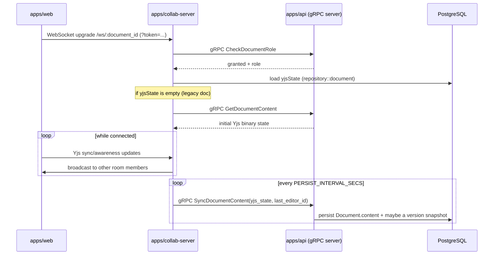

# collab-server

> The real-time collaboration server for infra-docs — Rust, Axum, and [yrs](https://github.com/y-crdt/y-crdt)/y-sync.

**[English](./README.md) | [简体中文](./README.zh-CN.md)**

Part of the [infra-docs](../../README.md) monorepo. See the [root README](../../README.md) for the overall architecture.

## What it does

`collab-server` terminates the WebSocket connection `apps/web` opens for a document (`ws://.../ws/:document_id`) and hosts the CRDT "room" for that document using `yrs` (Rust port of Yjs) + `y-sync` for broadcast/subscription semantics. It is a **gRPC client**, not a server — it calls into `apps/api` for anything that requires shared business logic (role checks, content conversion), rather than re-implementing it.



## Module layout

| Path | Responsibility |
| --- | --- |
| `src/main.rs` | Process entry point — loads config, builds `AppState`, starts the Axum server |
| `src/handler/` | `health.rs` (health check), `ws.rs` (WebSocket upgrade / connection entry point) |
| `src/route/mod.rs` | Axum router assembly (`/healthz`, `/ws/:document_id`) |
| `src/service/collab.rs` | `RoomRegistry` — per-document CRDT rooms and their persistence triggers |
| `src/service/grpc_client.rs` | Typed gRPC client wrapper (`GrpcClients`) for calling `apps/api`, with backoff retries |
| `src/service/circuit_breaker.rs` | Circuit breaker around `apps/api` reachability (closed/open/half-open) |
| `src/service/ws_adapter.rs` | Adapts an Axum WebSocket into the Sink/Stream `y-sync` expects |
| `src/repository/document.rs` | Direct PostgreSQL access to a document's `yjsState` column (via `sqlx`) |
| `src/middleware/auth.rs` | JWT verification middleware for incoming connections |
| `src/utils/{config,jwt}.rs` | Env-based configuration loading; JWT verification helpers |

## Development

Requires a system-level `protoc` (the build script generates gRPC client code from `/protos` on every `cargo build`).

```bash
cp .env.example .env
cargo run -p collab-server
# or from the repo root:
make dev-collab
```

## Environment variables

See [`.env.example`](./.env.example) for the full list; the notable ones:

| Variable | Description |
| --- | --- |
| `SERVER_HOST`, `SERVER_PORT` | Listen address (default `0.0.0.0:4000`) |
| `APP_ENV` | `development` (pretty logs) / `production` (structured JSON logs, aligned with `apps/api`'s Pino output) |
| `DATABASE_URL` | PostgreSQL connection string (direct `sqlx` access, shared database with `apps/api`) |
| `JWT_SECRET` | **Must match** `apps/api`'s `JWT_SECRET` — verified locally against incoming access tokens, no round-trip needed |
| `API_GRPC_ADDR` | `apps/api`'s gRPC address (`http://127.0.0.1:4011` locally, `http://api:4011` in Docker Compose) |
| `PERSIST_INTERVAL_SECS` | How often (seconds) an active room's content is synced back via gRPC (default `120`) |

## Rust tooling

From the repo root:

```bash
make check       # cargo check
make clippy       # cargo clippy -- -D warnings
make fmt           # cargo fmt
make fmt-check     # cargo fmt -- --check
make test-rust     # cargo test
make build-rust    # cargo build --release
```

## Tech stack

Rust · Axum (HTTP/WebSocket) · Tonic (gRPC client) · yrs / y-sync (CRDT) · sqlx (PostgreSQL) · jsonwebtoken · tracing
