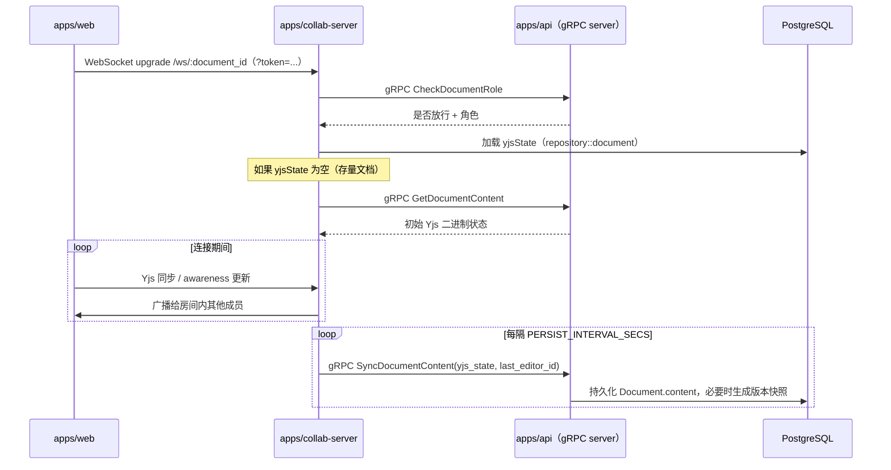

# collab-server

> infra-docs 的实时协同服务 —— Rust、Axum，以及 [yrs](https://github.com/y-crdt/y-crdt)/y-sync。

**[English](./README.md) | [简体中文](./README.zh-CN.md)**

属于 [infra-docs](../../README.zh-CN.md) monorepo 的一部分，整体架构见[根目录 README](../../README.zh-CN.md)。

## 做什么

`collab-server` 承接 `apps/web` 为某篇文档打开的 WebSocket 连接（`ws://.../ws/:document_id`），用 `yrs`（Yjs 的 Rust 移植）+ `y-sync`（提供广播/订阅语义）为这篇文档托管一个 CRDT "房间"。它是一个**gRPC 客户端**，不是服务端——任何需要共享业务逻辑的地方（角色校验、内容转换）都通过 gRPC 调用 `apps/api`，不会自己重新实现一套。



## 模块结构

| 路径 | 职责 |
| --- | --- |
| `src/main.rs` | 进程入口——加载配置、构建 `AppState`、启动 Axum server |
| `src/handler/` | `health.rs`（健康检查）、`ws.rs`（WebSocket upgrade / 连接入口） |
| `src/route/mod.rs` | Axum 路由组合（`/healthz`、`/ws/:document_id`） |
| `src/service/collab.rs` | `RoomRegistry`——按文档管理的 CRDT 房间及其持久化触发 |
| `src/service/grpc_client.rs` | 调用 `apps/api` 的类型化 gRPC 客户端封装（`GrpcClients`），带退避重试 |
| `src/service/circuit_breaker.rs` | 针对 `apps/api` 可达性的熔断器（关闭/开启/半开三态） |
| `src/service/ws_adapter.rs` | 把 Axum 的 WebSocket 适配成 `y-sync` 需要的 Sink/Stream |
| `src/repository/document.rs` | 直接通过 `sqlx` 读写文档的 `yjsState` 字段 |
| `src/middleware/auth.rs` | 对入站连接做 JWT 校验的中间件 |
| `src/utils/{config,jwt}.rs` | 基于环境变量的配置加载；JWT 校验工具函数 |

## 开发

需要系统级 `protoc`（build script 会在每次 `cargo build` 时根据 `/protos` 重新生成 gRPC 客户端代码）。

```bash
cp .env.example .env
cargo run -p collab-server
# 或在仓库根目录：
make dev-collab
```

## 环境变量

完整列表见 [`.env.example`](./.env.example)，关键几项：

| 变量 | 说明 |
| --- | --- |
| `SERVER_HOST`、`SERVER_PORT` | 监听地址（默认 `0.0.0.0:4000`） |
| `APP_ENV` | `development`（pretty 日志）/ `production`（结构化 JSON 日志，跟 `apps/api` 的 Pino 输出风格对齐） |
| `DATABASE_URL` | PostgreSQL 连接串（通过 `sqlx` 直连，跟 `apps/api` 共用同一个数据库） |
| `JWT_SECRET` | **必须**跟 `apps/api` 的 `JWT_SECRET` 一致——本地直接校验入站 access token 的签名，不需要额外一次网络往返 |
| `API_GRPC_ADDR` | `apps/api` 的 gRPC 地址（本机默认 `http://127.0.0.1:4011`，容器网络里换成 `http://api:4011`） |
| `PERSIST_INTERVAL_SECS` | 一个活跃房间的内容多久（秒）通过 gRPC 同步回落库一次（默认 `120`） |

## Rust 工具链

在仓库根目录：

```bash
make check       # cargo check
make clippy       # cargo clippy -- -D warnings
make fmt           # cargo fmt
make fmt-check     # cargo fmt -- --check
make test-rust     # cargo test
make build-rust    # cargo build --release
```

## 技术栈

Rust · Axum（HTTP/WebSocket） · Tonic（gRPC 客户端） · yrs / y-sync（CRDT） · sqlx（PostgreSQL） · jsonwebtoken · tracing
